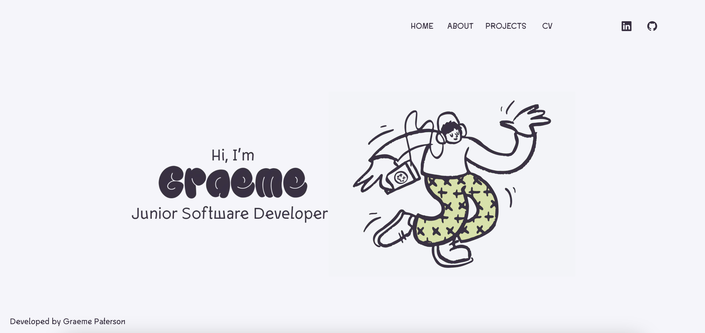
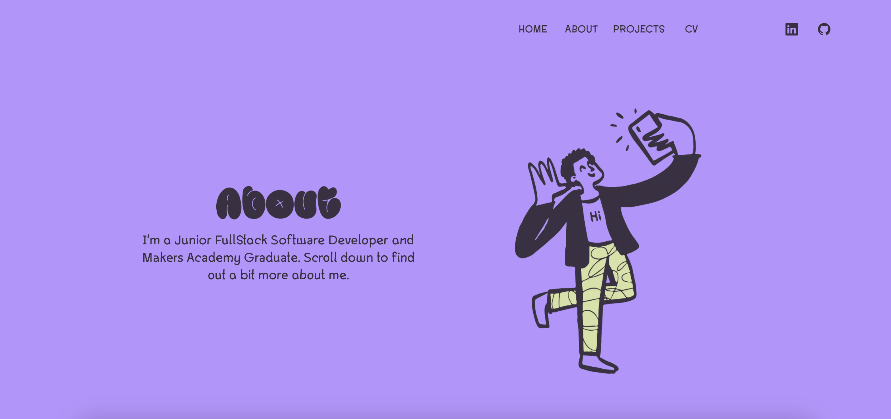
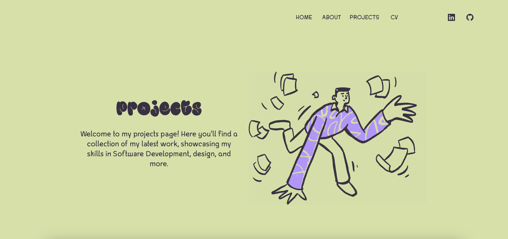

## Personal Portfolio Page

This is my personal porfolio, it is designed to highlight some of the projects that I am proud of. It has links to my Github Cv, personal Github and my Linkedin. The projects highlighted have links to their Github repositories.

## Frameworks

- Next.js
- Tailwindcss
- Figma

## Installation

```js
$ git clone https://github.com/ghpaterson/react-portfolio.git
$ cd portfolio
$ npm install
```

## Viewing the Portfolio

First, run the development server from the main project-directory:

```js
$ cd portfolio
$ npm run dev
```

Open [http://localhost:3000](http://localhost:3000) to see my portfolio in your browser.

visit www.graemepaterson.co.uk

## Screen

Home



About



Projects



## Deploy on Vercel

The easiest way to deploy your Next.js app is to use the [Vercel Platform](https://vercel.com/new?utm_medium=default-template&filter=next.js&utm_source=create-next-app&utm_campaign=create-next-app-readme) from the creators of Next.js.

Check out our [Next.js deployment documentation](https://nextjs.org/docs/deployment) for more details.
